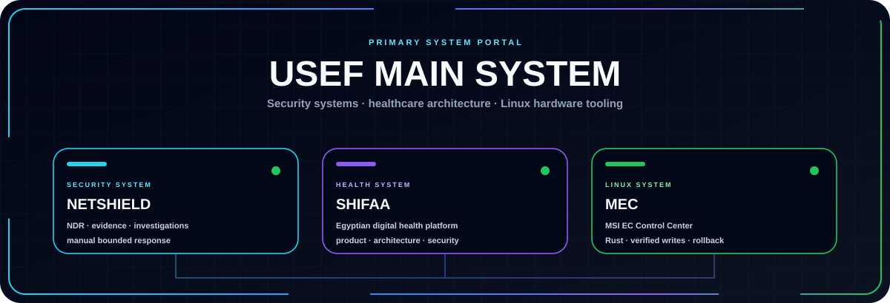
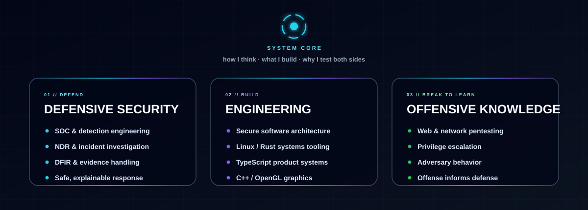
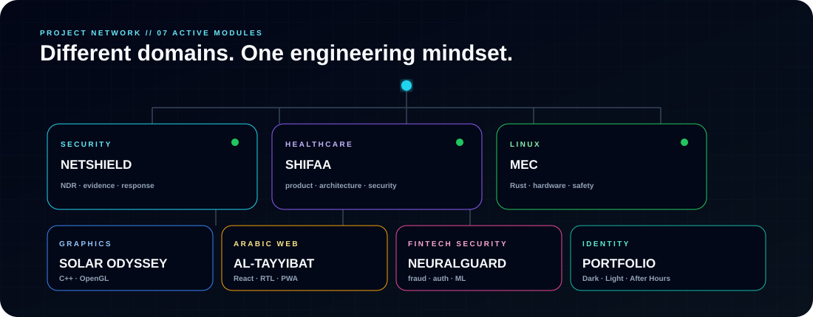
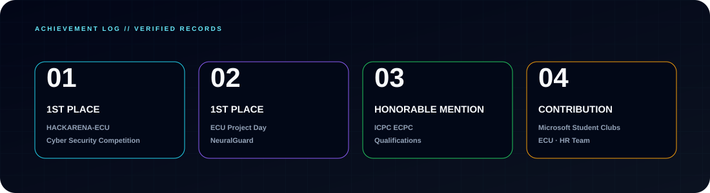
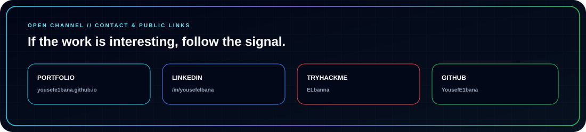

# YOUSEF OSAMA

<samp>Security is the lens. Engineering is the tool. Evidence decides what is true.</samp>

  

  

<a href="https://yousefe1bana.github.io/my-portfolio/"><b>Portfolio</b></a>
&nbsp;&nbsp;|&nbsp;&nbsp;
<a href="#project-network"><b>Projects</b></a>
&nbsp;&nbsp;|&nbsp;&nbsp;
<a href="#open-channel"><b>Connect</b></a>

<h2 align="center">SYSTEM ACCESS</h2>

<samp>Three primary systems that best represent how I work.</samp>

  

  <a href="https://github.com/YousefE1bana/Net-Shield"><b>NETSHIELD</b></a>
  &nbsp;&nbsp;·&nbsp;&nbsp;
  <a href="https://github.com/YousefE1bana/shifaa-project"><b>SHIFAA</b></a>
  &nbsp;&nbsp;·&nbsp;&nbsp;
  <a href="https://github.com/YousefE1bana/msi-ec-tui"><b>MEC</b></a>

<h2 align="center">SYSTEM CORE</h2>

  

<h2 align="center">PROJECT NETWORK</h2>

<samp>Seven implemented projects across security, healthcare, Linux, graphics and web.</samp>

  

<h3 align="center">FIELD EVIDENCE</h3>

Real screenshots and project artifacts from the published work.

<table>
<tr>
<td width="50%" valign="top" align="center">

 <b>NetShield</b> 
Network Detection & Response · Python / Linux
</td>
<td width="50%" valign="top" align="center">

 <b>SHIFAA</b> 
Egyptian digital health · Product / Architecture / Security
</td>
</tr>

<tr>
<td width="50%" valign="top" align="center">

 <b>Solar Odyssey</b> 
C++17 / OpenGL 4.5 scientific exploration sandbox
</td>
<td width="50%" valign="top" align="center">

 <b>Al-Tayyibat</b> 
Arabic-first RTL PWA · 385 food entries
</td>
</tr>

<tr>
<td width="50%" valign="top" align="center">

 <b>NeuralGuard</b> 
Application security & fraud detection · 1st Place ECU Project Day
</td>
<td width="50%" valign="top" align="center">

 <b>MEC — MSI EC Control Center</b> 
Rust · Linux sysfs · verified writes · rollback
</td>
</tr>

<tr>
<td colspan="2" valign="top" align="center">

 <b>Portfolio</b> 
Dark · Light · After Hours
</td>
</tr>
</table>

<h2 align="center">ARSENAL</h2>

<samp>Languages and platforms I actually use in the work above.</samp>

  

<code>SOC Operations</code> · <code>Detection Engineering</code> · <code>NDR</code> · <code>Incident Investigation</code> 
<code>Digital Forensics</code> · <code>Penetration Testing</code> · <code>Secure Architecture</code> · <code>Windows / Linux Security</code>

<h2 align="center">ACHIEVEMENT LOG</h2>

  

<h2 align="center">TELEMETRY</h2>

  
  

  

<h2 align="center">OPEN CHANNEL</h2>

  

<a href="https://yousefe1bana.github.io/my-portfolio/"><b>Portfolio</b></a>
&nbsp;&nbsp;·&nbsp;&nbsp;
<a href="https://www.linkedin.com/in/yousefelbana"><b>LinkedIn</b></a>
&nbsp;&nbsp;·&nbsp;&nbsp;
<a href="https://tryhackme.com/p/ELbanna"><b>TryHackMe</b></a>
&nbsp;&nbsp;·&nbsp;&nbsp;
<a href="https://github.com/YousefE1bana?tab=repositories"><b>Repositories</b></a>

<samp>BUILD // BREAK // DETECT // INVESTIGATE // VERIFY // IMPROVE</samp>

