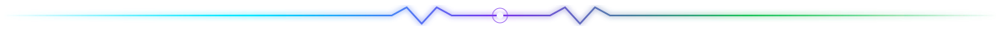
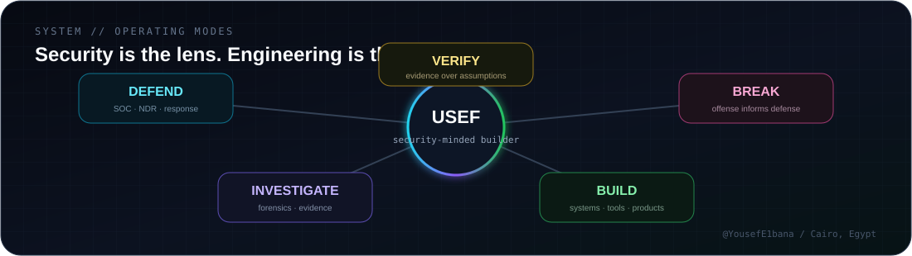
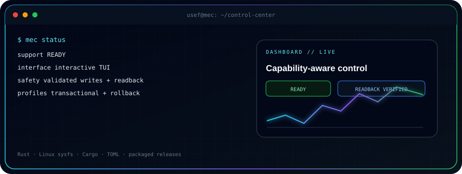

 

# YOUSEF OSAMA

<samp>
I build security systems, tools and products where <b>evidence matters more than assumptions.</b>
</samp>

  

  

### `WHOAMI`

Cybersecurity Engineering student targeting **SOC / defensive-security roles**.  
I use offensive training to understand attacker behavior, then turn that understanding into **detections, investigations, safer response paths and better software**.

**Cairo, Egypt · Building across Security, Linux, Healthcare, Web & Graphics**

<h2 align="center">PROJECT // FIELD WORK</h2>

<samp>Seven implemented projects. Different domains. Same obsession with building things properly.</samp>

<table>
<tr>
<td width="50%" valign="top">

### 🔵 [NetShield](https://github.com/YousefE1bana/Net-Shield)
**Network Detection & Response**

Home-SOC NDR that turns network activity into explainable alerts, investigations, evidence and bounded manual response.

`Python` · `Flask` · `Scapy` · `SQLite` · `Linux` · `nftables`

</td>
<td width="50%" valign="top">

### 🟢 [SHIFAA](https://github.com/YousefE1bana/shifaa-project)
**Egyptian Digital Health Platform**

Graduation project connecting patients, clinics, pharmacies, hospitals and laboratories.

Product Owner · Team Lead · Architecture Lead

`TypeScript` · `PostgreSQL` · `Supabase` · `Secure Architecture`

</td>
</tr>

<tr>
<td width="50%" valign="top">

### 🟣 NeuralGuard
**E-Banking Security System**

University banking-security prototype combining application security, transaction monitoring and fraud-model evaluation.

**🥇 1st Place — ECU Project Day**

`Python` · `React` · `XGBoost` · `Kafka` · `Spark`

</td>
<td width="50%" valign="top">

### 🌌 [Solar Odyssey](https://github.com/YousefE1bana/solar-odyssey)
**Scientific Exploration Sandbox**

31 celestial bodies, free-flight exploration, scientific layers, photo mode and a modern rendering pipeline.

`C++17` · `OpenGL 4.5` · `CMake` · `Ninja`

</td>
</tr>

<tr>
<td width="50%" valign="top">

### 🟡 [Al-Tayyibat](https://github.com/YousefE1bana/al-tayyibat)
**Arabic-first RTL PWA**

Interactive food-reference system covering **385 food entries**, search, ingredient checking, recipes, local favorites and offline use.

`React 19` · `TypeScript` · `Vite` · `PWA` · `RTL`

</td>
<td width="50%" valign="top">

### 🩷 [Portfolio](https://github.com/YousefE1bana/my-portfolio)
**Three dimensions, one person**

A design-forward cybersecurity portfolio with professional Dark / Light experiences and a personal **After Hours** world.

`React` · `TypeScript` · `Vite` · `Framer Motion`

</td>
</tr>
</table>

### 🟠 [MEC — MSI EC Control Center](https://github.com/YousefE1bana/msi-ec-tui)

Capability-aware Linux terminal control center for supported MSI laptops, with safe writes, hardware readback and transactional profiles.

`Rust` · `Cargo` · `Linux sysfs` · `TOML`

<h2 align="center">ARSENAL // TOOLS I ACTUALLY USE</h2>

  

`SOC Operations` · `Detection Engineering` · `NDR` · `Incident Investigation` · `Digital Forensics`  
`Penetration Testing` · `Secure Architecture` · `Windows Security` · `Linux Security`

<h2 align="center">ACHIEVEMENTS // RECEIPTS</h2>

<table>
<tr>
<td align="center" width="25%"><h3>🥇</h3><b>1st Place</b> HACKARENA-ECU Cyber Security Competition</td>
<td align="center" width="25%"><h3>🥇</h3><b>1st Place</b> ECU Project Day NeuralGuard</td>
<td align="center" width="25%"><h3>🏅</h3><b>Honorable Mention</b> ICPC ECPC Qualifications</td>
<td align="center" width="25%"><h3>⚡</h3><b>Contribution</b> Microsoft Student Clubs ECU</td>
</tr>
</table>

<h2 align="center">TELEMETRY // GITHUB</h2>

  
  

  
  

  

### `CURRENT MISSION`

Build toward defensive-security work where I can **understand the signal, reconstruct what happened, automate the boring parts and keep response explainable**.

 

<samp>BUILD // BREAK // DETECT // INVESTIGATE // VERIFY // IMPROVE</samp>

  

<a href="https://yousefe1bana.github.io/my-portfolio/"><b>Portfolio</b></a>
&nbsp;•&nbsp;
<a href="https://www.linkedin.com/in/yousefelbana"><b>LinkedIn</b></a>
&nbsp;•&nbsp;
<a href="https://tryhackme.com/p/ELbanna"><b>TryHackMe</b></a>
&nbsp;•&nbsp;
<a href="https://github.com/YousefE1bana?tab=repositories"><b>All Repositories</b></a>

